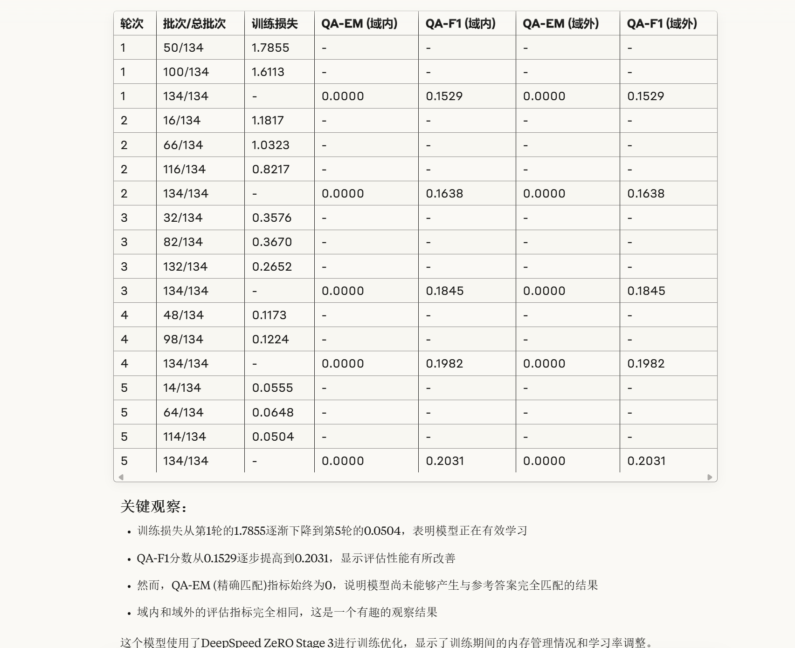
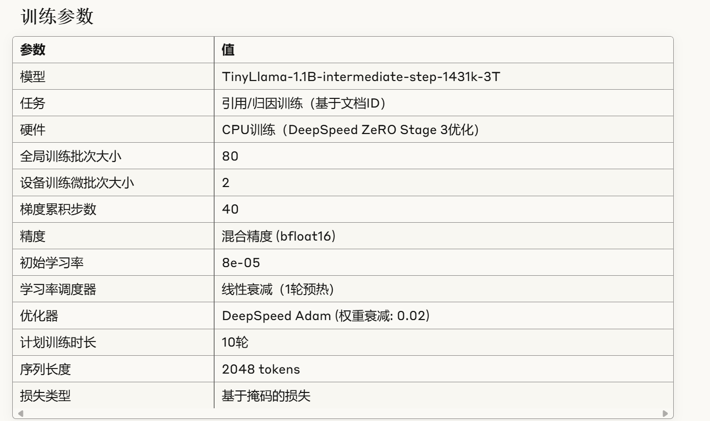
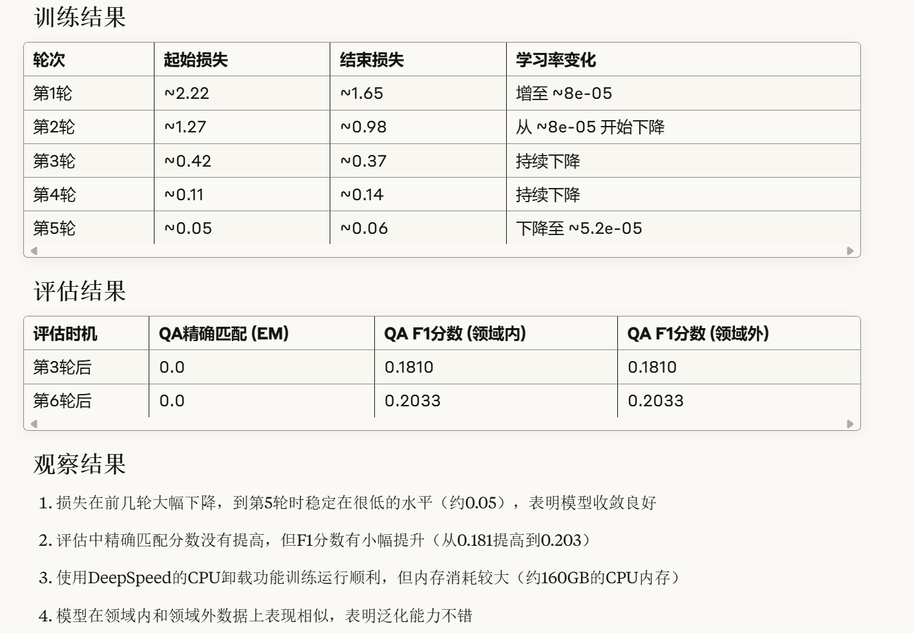
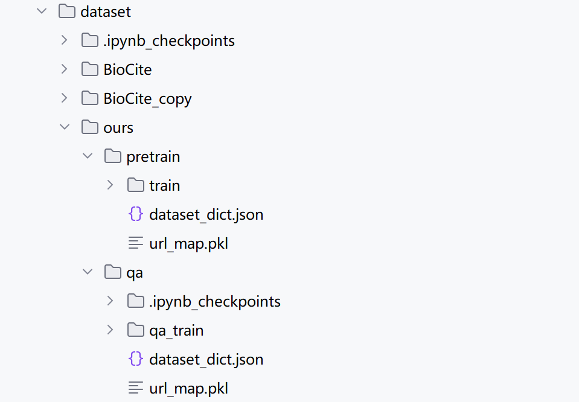

# run code
The environment has already been configured and adapted to the code in autodl, which can be quite complicated. Before modifying the code, you can backup the Northwest B zone/710 machine and Northwest B zone/274 machine.

The following configuration file occupies about 28GB of video memory. To speed up training, it is necessary to switch to a better machine.

```python
source /etc/network_turbo
python run_experiment.py conf/ours_doc_id_begin.yaml
```
just replace conf/ours_doc_id_begin.yaml（such as conf/ours_doc_id_end.yaml）

The configuration file is divided into two parts:

conf/ours_doc_id_begin.yaml and conf\templates\train_config.yaml

The default training parameter configuration is conf\templates\train_config.yaml，Parameter configurations not mentioned in conf/ours_doc_id_begin.yaml, use the parameters from train_config.yaml

```yaml
# Pretrain a gpt2 style model
text_data_path: /root/autodl-tmp/intrinsic-source-citation/dataset/ours/pretrain
streaming: outputs/experiments/arxiv-citation-doc-id-end/data/streaming/
tokenizer_name: ${streaming}/tokenizer
max_seq_len: 1024  
global_seed: 17
url_trie: ${streaming}/url_trie.pkl
ood_url_trie: ${streaming}/unseen_url_trie.pkl

# Run Name
run_name: arxiv-citation-doc-id-end
cross_doc_attention: false

# Model
model:
  name: hf_causal_lm
  pretrained_model_name_or_path: TinyLlama/TinyLlama-1.1B-intermediate-step-1431k-3T
  pretrained: true  # Decide whether to conduct pre training. Pre training takes a short time of two to three minutes and can be left unchanged
  loss:
    type: mask  # Corresponding to the loss_type in the configuration file
    url_loss_factor: 1.0
  

  
  ckpt_dir: outputs/experiments/arxiv-citation-doc-id-end/checkpoints
  # checkpoint: "outputs/experiments/arxiv-citation-doc-id-end/checkpoints/latest"  # Specific checkpoint paths (where breakpoint training can be performed on breakpoints)
    
# Tokenizer 
# Tokenizer
tokenizer:
  name: ${tokenizer_name}
  kwargs:
    model_max_length: ${max_seq_len}


# Dataloaders
dataloaders:
  - name: train_loader_docs
    dataset:
      local: ${streaming}
      split: train
      shuffle: true
      max_seq_len: ${max_seq_len}
      batch_type: lm
      masking:
        cross_doc_attention: ${cross_doc_attention}
    drop_last: false
    num_workers: 0
  
  # Evaluate the data loader section
  - name: in_domain_standard_q_answer_eval_loader
    dataset:
      path: /root/autodl-tmp/intrinsic-source-citation/dataset/ours/qa
      split: qa_train
      shuffle: false
      max_seq_len: ${max_seq_len}
      batch_type: qa
    drop_last: false
    num_workers: 0

  - name: out_of_domain_standard_q_answer_eval_loader
    dataset:
      path: /root/autodl-tmp/intrinsic-source-citation/dataset/ours/qa
      split: qa_train
      shuffle: false
      max_seq_len: ${max_seq_len}
      batch_type: qa-ood 
    drop_last: false
    num_workers: 0

# Optimization
scheduler:
  name: linear_decay_with_warmup
  t_warmup: 1ep
  alpha_f: 0.1

optimizer:
  name: deepspeed_adam
  lr: 1.0e-4
  betas:
  - 0.9
  - 0.98
  eps: 1.0e-06
  weight_decay: 0.0

algorithms:
  gradient_clipping:
    clipping_type: norm
    clipping_threshold: 1.0

max_duration: 10ep # 
eval_interval: 3ep
eval_first: false
eval_subset_num_batches: -1
global_train_batch_size: 64 # 128 initially

# System 
seed: ${global_seed}
device_eval_batch_size: 64      # Evaluate Batch
device_train_microbatch_size: 4  # Send in 4 samples for each training session

# device_train_microbatch_size: auto
precision: amp_bf16

deepspeed_config:
  bf16:
    enabled: true
  train_batch_size: ${global_train_batch_size}
  zero_optimization:
    stage: 3  
    contiguous_gradients: true
    reduce_bucket_size: true
    overlap_comm: true
    allgather_bucket_size: 2e8
    reduce_scatter: true
    offload_optimizer:
      device: cpu
      pin_memory: true
    
    # stage: 2  
    # contiguous_gradients: true
    # reduce_bucket_size: 2e8
    # overlap_comm: true
    # allgather_partitions: true
    # allgather_bucket_size: 2e8
    # reduce_scatter: true
    # cpu_offload: true


# Logging
progress_bar: false
log_to_console: true
console_log_interval: 50ba

callbacks:
  speed_monitor:
    window_size: 10
  lr_monitor: {}
  memory_monitor: {}
  runtime_estimator: {}

loggers:
   wandb: 
    project: intrinsic-source-citation

# Checkpoint to local filesystem or remote object store
save_interval: 1ep
save_num_checkpoints_to_keep: 1 
save_folder: "outputs/experiments/arxiv-citation-doc-id-end/checkpoints"  # You can keep the checkpoints for model training here
```


If the parameter is defined in conf/ours_doc_id_begin. yaml, use the configuration of conf/ours_doc_id_begin. yaml

```yaml
# Experiment Configuration

experiment:
  name: arxiv-citation-doc-id-begin
  output_dir: outputs/experiments/

data:
  text_data_path: dataset/ours/pretrain  # Point to the directory of pre training datasets
  train_data_path: /root/autodl-tmp/intrinsic-source-citation/dataset/ours/pretrain/train
  qa_data_path: /root/autodl-tmp/intrinsic-source-citation/dataset/ours
  augment:
    doc:
      do: false
      method: permute
      n_sample_per_doc: 2
  finetune:
    number_non_attributable_negatives: 0
    neg_create_probability: 0.0

model:
  name: TinyLlama/TinyLlama-1.1B-intermediate-step-1431k-3T

train:
  url_location: first  # The URL location is at the beginning of the document
  pretrain: true  # Decide whether to conduct pre training. Pre training takes a short time of two to three minutes and can be left unchanged
  sequential: false
  finetune_q_url_a: false
  repeat_url_across_doc: false
  finetune_q_a_url: true
  finetune_q_a: false
  finetune_q_a_doc_url: false
  q_a_url_predict_url_only: false
  
  # Loss and attention allocation
  cross_doc_attention: false
  url_loss_factor: 1.0
  loss_type: mask
  config_template_path: conf/templates/train_config.yaml
  
  # Training parameters
  device_eval_batch_size: 40
  device_train_microbatch_size: 2
  eval_first: false
  weight_decay: 0.02
  lr: 8.0e-5
  max_duration: 10ep
  save_folder: "outputs/experiments/arxiv-citation-doc-id-begin/checkpoints" # You can keep the checkpoints for model training here

eval:  
  disable_qa_eval: false
  disable_all_eval: false
  disable_attribution_eval: false
  disable_non_attrib_eval: true
  icl_eval: false
  ppl_eval: false
  use_ais: false
```

# quick train and evaluation
Training evaluation results for conf/ours_doc_id_begin.yaml：

| Parameter | Value |
|-----------|-------|
| Model | TinyLlama/TinyLlama-1.1B-intermediate-step-1431k-3T |
| Number of Parameters | 1,100,056,576 (about 1.1B) |
| Optimizer | DeepSpeedCPUAdam (ZeRO Stage 3) |
| Learning Rate | 8.0e-05 (initial) |
| Learning Rate Scheduler | Linear decay with warmup |
| Warmup Steps | 1 epoch |
| Batch Processing Size | Full batch: 80, devices: 80, micro-batch: 2 |
| Gradient Accumulation Steps | 40 |
| Precision | amp_bf16 (mixed precision, BF16) |
| Maximum Sequence Length | 2048 |
| Total Training Cycles | 10 |
| Weight Decay | 0.02 |
| Gradient Clipping | 1.0 |
| Seeds | 17 |




Training evaluation results for conf/ours_doc_id_end.yaml：



model checkpoints：https://huggingface.co/Kevin3777/arxiv-citation-doc-id-begin/tree/main

Preprocessed dataset: link as above

The structure of the dataset (just focus on ours)：



# Source-Aware Training Enables Knowledge Attribution in Language Models

We explore **Source-aware Training** to enable LLMs to cite their pretraining data. Source-aware training involves (i) training the LLM to associate unique source document identifiers with the knowledge in each document, followed by (ii) an instruction-tuning to teach the LLM to cite a supporting pretraining source when prompted. We demonstrate that our training recipe can enable faithful attribution to the pretraining data without a substantial impact on the model's quality compared to standard pretraining. Our results also highlight the importance of data augmentation in achieving attribution.

<p align="center">

</p>

📝 **Paper**: [https://arxiv.org/abs/2404.01019](https://arxiv.org/abs/2404.01019)

🤗 **Data**: [https://huggingface.co/datasets/mkhalifa/BioCite](https://huggingface.co/datasets/mkhalifa/BioCite)


### Getting Started
To set up the code and run source-aware training, you will first need to set up the environment. Our code is based on the [llm-foundry](https://github.com/mosaicml/llm-foundry) package by mosaicml. Let's go through the setup step-by-step. 

We recommend using conda to set up the environment:
```python
conda create --name=citation-training python=3.10
conda activate citation-training
```
Now you need to install `torch==2.0.1` which is the version with which the paper experiments were done. You can get it from [here](https://pytorch.org/get-started/previous-versions/).

Then you need to install dependencies via:
```
pip install -r requirements.txt
```

### Downloading Data
Our experiments are done over BioCite a synthetic corpus of biographies about fictitious individuals. Each document in BioCite is constructed by sampling multiple facts from different biographies. Each document ID is constructed as a concatenation of 3-letter prefix of each last name in the document. 
<p align="left">

</p>

BioCite is available on huggingface [here](https://huggingface.co/datasets/mkhalifa/BioCite)

### Running Experiments

#### One-script-for-all
To eliminate the need to run many consecutive scripts, I designed the code such that a single script will do everything. Specifically, `run_experiment.py` will take as input a configuration file (more on that later) and will: 
1. Perform data augmentation if necessary (by shuffling facts within the document as described in the paper)
2. Preprocess the pretraining data by injecting Doc IDs (referred to as **URL** throughought the code) into the pretraining data as per the passed config
3. Preprocess and tokenize the instruction tuning comprised of <Question, Answer, Doc ID> triplets
4. Builds the Doc ID Trie needed for constrained decoding when predicting doc IDs. 
5. Save all tokenized data to specified experiment folder in numpy `.npz` format.
6. Run pretraining using next-word objective on the documents with injected doc IDs
7. After pretraining finishes, loads the last checkpoint and does instruction tuning.
8. Logs all evals to W&B

#### Example Config
Here is an example of a config file and I'll explain the relevant parameter. Configs for paper experiments can be found [here](conf):

```yaml

experiment:
  name: my-experiment
  output_dir: path-to-experiments-folder

data:
  text_data_path: path-to-training-corpus
  augment: # Data augmentation parameters
    doc:
      do: true
      method: permute
      n_sample_per_doc: 2 # Number of augmentations per document. This means that each document will exist 1 + 2 = 3 times with different sentence permutations

model:
  name: TinyLlama/TinyLlama-1.1B-intermediate-step-1431k-3T

train:
  url_location: last # inject doc ID at the end. Options are last, first, no_url
  pretrain: true # whether to run next-word-prediction
  sequential: true, # whether to do pretraining then finetuning. If false, will only do pretraining
  repeat_url_across_doc: false # whether to repeat doc ID across the document.
  finetune_q_a_url: true # finetuning will take question as input, and predict answer then doc ID. 
  finetune_q_a_doc_url: false # set this to true for the CoT setup

  ## loss and attn config 
  cross_doc_attention: false # whether to apply cross-doc attention across documents. It is best to disable this. 
  url_loss_factor: 1.0 # coefficient to multiply the loss on the doc ID tokens by. Doesn't make much difference
  loss_type: mask # always mask, do not change this
  config_template_path: conf/templates/train_config.yaml
  device_eval_batch_size: 40
  device_train_microbatch_size: 2
  eval_first: false # whether to run evaluation first before training
  weight_decay: 0.02
  lr: 8.0e-5
  max_duration: 10ep # train for 10 epochs
  save_folder: null

eval:  
  disable_qa_eval: false
  disable_all_eval: false
  disable_attribution_eval: false
  disable_non_attrib_eval: true # leave this to true, non-attrib eval was not used in the paper. 
  icl_eval: false # whether to run ICL evaluation using some tasks. 
  ppl_eval: true # whether to evaluate the model using perplexity on wikitext as done in the paper
```


After you've set up your config file.

#### Launch your own experiment
To launch an experiment on a 1K-doc subset of BioCite, you can use the config file `conf/doc-id-repeat-1k-docs.yaml` by running:
`python run_experiment.py conf/doc-id-repeat-1k-docs.yaml`. This subset is located in `sample-data/biocite-1k`. 

There are config file correponding to each different setup used in the paper in `conf/`. 

### Distributed Training
By default, the code uses ZeRO implementation by [Deepspeed](https://github.com/microsoft/DeepSpeed) for distributed training. The deepseed parameters are defined in `conf/templates/train_config.yaml`. The defaul parameters are 
```yaml
deepspeed_config:
  bf16:
    enabled: true
  train_batch_size: ${global_train_batch_size}
  zero_optimization:
    stage: 3
    contiguous_gradients: true
    reduce_bucket_size: true
    overlap_comm: true
    allgather_bucket_size: 2e8
    reduce_scatter: true
    offload_optimizer:
      device: cpu
      pin_memory: true
```

### Citation
If you find our work/code useful please cite it:
```yaml
@inproceedings{
sourceaware2024,
title={Source-Aware Training Enables Knowledge Attribution in Language Models},
author={Khalifa, Muhammad and Wadden, David and Strubell, Emma and Lee, Honglak and Wang, Lu and Beltagy, Iz and Peng, Hao},
booktitle={First Conference on Language Modeling},
year={2024},
url={https://openreview.net/forum?id=UPyWLwciYz}
}
```
